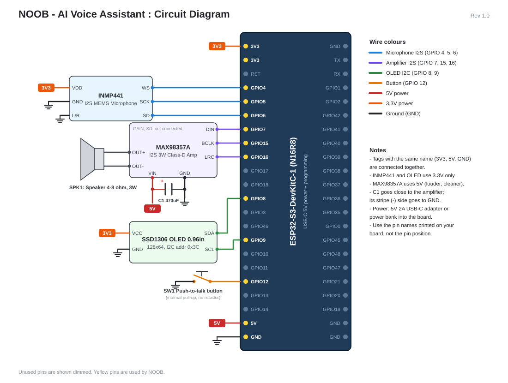

# NOOB — Your Multilingual AI Friend with Healthcare Knowledge

NOOB is a voice assistant, like Alexa, built on an **ESP32-S3** microcontroller with a companion **NOOB App**.
Talk to it in **any language** and it answers out loud in the same language with a natural **female voice**.
NOOB remembers what you tell it — even after it is switched off — and is specially instructed for
**healthcare**: symptoms, first aid, medicines, nutrition, mental well-being, and when to see a doctor.

**Everything NOOB uses is free.** The only cost is the electronic components.



---

## 1. Features

| Feature | How it works |
|---|---|
| Talk by voice — on the NOOB device **or** in the NOOB App | Hold the button on NOOB, or tap the orb in the app |
| Conversation mode | The app keeps listening after each answer, like chatting with a friend |
| **Fast answers** — first words in ~2–4 s, voice starts while the rest is still being written | Voice goes straight to Gemini (compressed), minimal "thinking", streaming sentence by sentence |
| Understands every major language (Hindi, English, Tamil, Bengali, Marathi, Gujarati, ...) | Gemini listens to the voice directly; Whisper on the PC is the offline backup |
| Replies in the same language, female voice (70+ languages) | Microsoft Edge neural voices |
| General knowledge, today's date & time, live news / weather / scores | Google Gemini (free tier) + PC clock + free DuckDuckGo web search |
| Works offline too | Automatic backup to a local AI (Ollama + Gemma 3) |
| Healthcare knowledge with safety rules | Emergencies → 112 / 108, Tele MANAS 14416, no false diagnoses |
| **Understands your mental well-being** | Notices how you feel from your words and your *tone of voice*, answers with care, checks in when you seem low for days; mood history on the Memory page (private, can be cleared) |
| Knows about everything | Science, maths, history, coding, sports, films, law, money, cooking, travel... plus live web search for anything recent |
| **Plays songs from YouTube** | *"Play Kesariya"*, *"गाना चलाओ"*: the app plays it in YouTube's own player (pause / another video / stop, or just say "stop the music"); the NOOB device plays the sound on its speaker — press the button to stop |
| **Permanent memory** | Everything NOOB learns is saved in a local database and survives power-off |
| **NOOB App**: About Me, Memory, Conversations, Devices, Settings | Web app (HTML + CSS + JavaScript) served by the NOOB server |
| **Continue with NOOB** | Sign in with your NOOB social media account (nooob.xyz) — no new password needed |
| Free trial for people without NOOB | Accounts made without a NOOB account get 5 free questions, then link NOOB for unlimited |
| 5-star rating | After the first 15 questions, NOOB AI asks for a 1–5 star rating (the owner sees them in Settings) |
| Animated 3D core and logo | A spinning wireframe globe with orbiting comets and a friendly blinking face (pure CSS 3D) |
| **Accounts** — family and friends get their own NOOB | Sign in / create account; each person has their own memory, About Me and devices (new accounts need an invite code) |
| Robot ⇄ app always know about each other | NOOB says hello to the PC every 15 s: the app shows it **Online / Offline**, and NOOB's screen shows whether the PC is on |
| **Connect to nearby devices** | The app finds NOOB devices on your Wi-Fi and pairs with a 4-digit code on NOOB's screen |
| Status screen | 0.96" OLED: Ready (Hi, your name!) / Listening / Thinking / Speaking / pairing code / PC offline |

### Languages used to build NOOB

| Part | Language |
|---|---|
| NOOB device firmware | **C++** (Arduino) |
| NOOB server (speech, AI, memory, devices) | **Python** |
| NOOB App (user interface) | **HTML, CSS, JavaScript** |
| Memory database | **SQL** (SQLite) |

---

## 2. How it works

```
 ┌──────────── NOOB device ────────────┐        ┌──────────────────── NOOB server (your PC) ────────────────────┐
 │ INMP441 mic ─I2S─►                  │ Wi-Fi  │ 1. Whisper      speech ──► text + language                    │
 │                  ESP32-S3 ─────────────────────►2. Gemini AI   question ──► answer (+ date/time, web search)  │
 │ MAX98357A ◄─I2S─  (PSRAM) ◄─────────────────────3. Edge TTS    answer ──► female voice                        │
 │  └► speaker                         │ audio  │                                                               │
 │ OLED ◄─I2C─   Button ─►             │        │ Memory database (noob_memory.db)  ◄──►  NOOB App (browser)    │
 └─────────────────────────────────────┘        └───────────────────────────────────────────────────────────────┘
```

1. **Record** – While the button is held, the ESP32-S3 reads the INMP441 digital microphone over I2S
   at 16,000 samples per second and stores up to 10 seconds of audio in PSRAM.
   (In the app, your PC's microphone is used and NOOB stops listening when you stop talking.)
2. **Send** – The audio is sent over Wi-Fi to the NOOB server on your PC.
3. **Understand** – The recording is compressed (~10 KB) and sent straight to Gemini, which understands
   speech in every language and writes down what it heard. (Offline backup: Whisper on the PC.)
4. **Think** – The text goes to the AI with NOOB's friendly personality, healthcare safety rules, your
   About Me details, everything NOOB remembers, the last few messages, and today's date and time.
   If the AI needs live information it asks for a web search (`SEARCH:`), and it saves or deletes memories
   with `REMEMBER:` / `FORGET:` lines (never spoken).
5. **Speak** – As soon as the first sentence of the answer is written, it is turned into NOOB's female voice
   and sent; the next sentences follow while the first one is playing.
6. **Play** – The ESP32-S3 streams the audio to the MAX98357A amplifier over I2S and the speaker plays it.

**Why a server?** An ESP32 has 8 MB of memory; a modern AI model needs many gigabytes. So the ESP32
handles the hardware and the heavy AI runs on the PC and in the cloud — the same design used by
commercial smart speakers.

| Part | Service | Cost |
|---|---|---|
| Speech → text | Gemini (listens directly); Whisper on the PC as offline backup | Free |
| AI brain | Google Gemini API free tier (fast "flash-lite" models first, others as backup) | Free (daily limit per model) |
| Backup AI brain | Ollama + Gemma 3 4B (runs on the PC, offline) | Free |
| Female voice | Microsoft Edge neural voices | Free |
| Live web search | DuckDuckGo (no account needed) | Free |
| Memory | SQLite database on the PC | Free |

---

## 3. Components (Bill of Materials)

| # | Component | Qty | Purpose | Approx. price (INR) |
|---|---|---|---|---|
| 1 | **ESP32-S3-DevKitC-1 N16R8** (16 MB flash, 8 MB PSRAM) | 1 | Brain of the device, Wi-Fi | 650 – 900 |
| 2 | **INMP441** I2S MEMS microphone module | 1 | Digital microphone | 200 – 250 |
| 3 | **MAX98357A** I2S 3 W class-D amplifier module | 1 | Drives the speaker | 250 – 350 |
| 4 | Speaker **4 Ω or 8 Ω, 3 W** (40–50 mm) | 1 | Voice output | 80 – 150 |
| 5 | **SSD1306 0.96" OLED**, 128×64, **I2C, 4-pin** | 1 | Status display + pairing code | 200 – 250 |
| 6 | Tactile push button (6 mm or 12 mm) | 1 | Push-to-talk | 10 |
| 7 | 470 µF – 1000 µF, 10 V (or higher) electrolytic capacitor | 1 | Stops voltage dips when the speaker is loud | 10 |
| 8 | 830-point breadboard | 2 | The ESP32-S3 board is wide — place it across two | 160 |
| 9 | Jumper wires (male-to-male) | 30 | Connections | 100 |
| 10 | USB-C **data** cable | 1 | Programming + power | 100 |
| 11 | 5 V / 2 A USB charger or power bank | 1 | Power | — |

Approximate total: **₹2,000 – 2,500**. Tools: soldering iron + solder (the mic and amplifier modules usually
come with loose header pins that must be soldered).

> **Buying tips.** The ESP32 board **must say N16R8 or N8R8** (the "R8" = 8 MB PSRAM, needed to hold the recording).
> Buy the **I2C** OLED (4 pins: GND, VCC, SCL, SDA), not the 7-pin SPI version.

---

## 4. Wiring

| From module | Module pin | ESP32-S3 pin | Wire colour in diagram |
|---|---|---|---|
| INMP441 microphone | VDD | **3V3** | orange |
| | GND | GND | black |
| | L/R | GND (selects left channel) | black |
| | WS | **GPIO 4** | blue |
| | SCK | **GPIO 5** | blue |
| | SD | **GPIO 6** | blue |
| MAX98357A amplifier | VIN | **5V** | red |
| | GND | GND | black |
| | DIN | **GPIO 7** | purple |
| | BCLK | **GPIO 15** | purple |
| | LRC | **GPIO 16** | purple |
| | GAIN, SD | not connected | — |
| | + / − (speaker terminals) | Speaker wires | grey |
| C1 470 µF capacitor | + (long leg) → amplifier VIN, − (striped side) → GND | | |
| SSD1306 OLED | VCC | **3V3** | orange |
| | GND | GND | black |
| | SDA | **GPIO 8** | green |
| | SCL | **GPIO 9** | green |
| Push button | one leg | **GPIO 12** | yellow-orange |
| | other leg | GND | black |

**Safety checks before powering on**

- The INMP441 and the OLED are **3.3 V parts** — never connect them to 5V.
- The capacitor is polarised: the stripe side goes to **GND**.
- Use the pin **names printed on your board** (e.g. "5", "15", "5V"), not the position — some clone boards shift pins.
- All GND pins are connected together.

The full diagram is in [`docs/circuit_diagram.svg`](docs/circuit_diagram.svg) (open it in any web browser).

---

## 5. Setup

### 5.1 NOOB server + NOOB App (on your Windows PC)

1. Install **Python 3.12 or newer** from python.org (tick *"Add Python to PATH"*). Tested with Python 3.14.
2. Get the project: on GitHub click **Code → Download ZIP** and unzip it (or `git clone` it)
   onto a drive with **at least 2 GB free**.
3. Double-click **`server/Setup NOOB.bat`** (one time). It installs everything NOOB needs **inside the
   `server` folder** (about 300 MB, 5–15 minutes).
4. Double-click **`server/NOOB App.bat`**.
   It starts the NOOB server in the background and opens the NOOB App in its own window.
   The first start downloads the speech model (~480 MB, also kept inside the `server` folder).
   Allow Python through the Windows firewall (*Private networks*) and allow the microphone when asked.
5. The app asks you to **create the owner account** (your name, a username and a password).
   Anything NOOB remembered before accounts existed becomes yours.
6. Open **Settings** and paste a **free Gemini API key**: go to **aistudio.google.com**, sign in with a
   Google account, click the **key icon (API keys) → Create API key** (no credit card needed).
   If one free Gemini model is busy or out of its daily quota, NOOB automatically uses another free one.
7. *(Optional, offline backup)* Install **Ollama** from **ollama.com**, then run `ollama pull gemma3:4b`.
   If Gemini is unavailable (no internet or daily limit), NOOB uses this local AI automatically (slower).

You can now talk to NOOB in the app, even before the hardware is built.

### 5.2 NOOB device (ESP32-S3)

1. Install **Arduino IDE 2**.
2. *File → Preferences → Additional boards manager URLs*, add:
   `https://raw.githubusercontent.com/espressif/arduino-esp32/gh-pages/package_esp32_index.json`
3. *Tools → Board → Boards Manager* → install **esp32 by Espressif Systems** (version 3.x).
4. *Tools → Manage Libraries* → install **Adafruit SSD1306** (accept "Install all" for Adafruit GFX).
5. Open `noob_esp32/noob_esp32.ino` and change **only two lines** at the top: your Wi-Fi name and password.
   > Tip: use your **phone's hotspot**, and connect the PC to the same hotspot. Then NOOB works anywhere —
   > at home, at school, or at the competition — without changing the code.
6. *Tools* menu settings:

   | Setting | Value |
   |---|---|
   | Board | ESP32S3 Dev Module |
   | PSRAM | **OPI PSRAM** |
   | Flash Size | 16MB (128Mb) |
   | USB CDC On Boot | **Disabled** if the cable is in the port marked *COM/UART*; **Enabled** if it is in the port marked *USB* |
   | Port | the COM port of your board |

7. Click **Upload**. The OLED shows **"Not paired yet"**.

### 5.3 Connect NOOB to the app (one time)

1. In the NOOB App open **Devices → Scan now**. Your NOOB appears (e.g. *NOOB-3F2A*).
2. Click **Connect**. NOOB's screen shows a **4-digit code**.
3. Type the code in the app → **Connected!** The OLED shows **Ready — Hi, <your name>!**
4. The device now belongs to **your account**: it uses your memory and About Me.

After that, NOOB and the app keep track of each other by themselves:

- NOOB says hello to the PC every 15 seconds. The app shows **● Online** (Devices page and Talk page).
  If NOOB is switched off, it shows **● Offline** within about a minute.
- If the PC is off or the app is closed, NOOB's screen shows **PC offline** and keeps checking.
  When the PC is back, NOOB shows **Ready** again. If the PC gets a new IP address, NOOB finds it again.
- The pairing is saved on NOOB (it survives power-off). Only devices running the NOOB firmware appear
  in the scan, and a device only accepts a PC when you type the code shown on its own screen.

---

## 6. Using NOOB

**On the NOOB device:** hold the button, speak, release. The OLED shows *Listening → Thinking → Speaking*.
Press the button once while NOOB is talking or playing a song to stop it.

**In the NOOB App:**

| Page | What you can do |
|---|---|
| **Talk** | Tap the orb (or press Space) and speak — NOOB stops listening when you stop talking and answers aloud. Turn on **Conversation mode** to keep chatting. You can also type. |
| **About Me** | Your name, age, city, blood group, allergies, conditions, medicines, doctor, emergency contact, hobbies... NOOB uses these in every answer. Also **My account**: link NOOB account, change password, sign out. |
| **Memory** | Everything NOOB remembered from your conversations. Search, add, edit or delete. |
| **Conversations** | Every question and answer from the app and the device, with search. |
| **Devices** | Connect to nearby NOOB devices, see and forget paired devices. |
| **Settings** *(owner only)* | Gemini key, who can join (invite code / open to NOOB users), accounts, server details, live log (other people's messages stay private), stop the server. |

The server keeps running after you close the app window, so the NOOB device keeps working.
Stop it in **Settings → Stop NOOB server**. Open the app again with `NOOB App.bat`.

Try: *"Mujhe do din se bukhar hai, kya karun?"*, *"Remember that my blood group is B positive"*,
*"What's today's date?"*, *"Who won yesterday's cricket match?"*, *"தலைவலிக்கு என்ன செய்யலாம்?"*,
*"Play Kesariya by Arijit Singh"*, *"Stop the music"*

### Songs from YouTube

Ask for any song, singer, bhajan or music. NOOB finds it on YouTube for free (no API key, using `yt-dlp`) and:

- **in the NOOB App** plays it in YouTube's own player on the Talk page (pause, try another video, stop). The music
  goes quiet while you talk to NOOB and continues afterwards. On some phones the first song needs one tap on ▶.
- **on the NOOB device** says what it will play, then plays the song's sound on the speaker (up to 15 minutes).
  Press the button to stop.

YouTube changes often; if songs stop working, run `Setup NOOB.bat` again — it fetches the newest `yt-dlp`.

---

### Accounts: letting other people use NOOB

- The first account is the **owner** (it can only be created on the NOOB PC itself).
- Family and friends create their own account on the sign-in page with the **invite code** shown in
  the owner's **Settings → People**. Everyone gets their own memory, About Me, conversations and devices.
  The owner can make a new invite code or remove accounts at any time.
- **On the same Wi-Fi:** others open `http://<PC-IP>:5000` (shown in Settings) in any browser, on a phone
  or laptop. Typing works everywhere; talking by voice needs an `https://` address (next section) —
  browsers only allow the microphone on secure pages.
- **Their own NOOB:** anyone can build their own NOOB device and run their own server from this GitHub project.

### Continue with NOOB (sign in with your NOOB social media account)

- On the sign-in page, click **Continue with NOOB** and enter your NOOB (nooob.xyz) username or email and
  password. The assistant checks them with NOOB's own login service, reads only your username and display name,
  and ends that login straight away — **your NOOB password is never saved**. Suspended NOOB accounts are refused.
- The first time, NOOB creates an assistant account for you. By default **anyone with a NOOB account can join
  without an invite code** (the owner can switch this off in Settings → People). After that, **Continue with NOOB**
  signs you straight in.
- Every person has their own private memory, chats, About Me and devices. Nobody can see anyone else's data,
  also not on a shared phone: a new NOOB AI sign-in always signs the previous person out first.
- Already have an assistant account? **Settings → My account → Link NOOB account**, then you can use either way.
- Every NOOB sign-in fills **About Me** with the person's NOOB signup details — name, birthday, gender, phone,
  email, city, bio, interests, website and business details — but only fields that are still empty, so anything
  the person typed is never overwritten. NOOB works out their age from the birthday and mentions phone numbers or
  email only when asked. Each person only ever gets their own details.

### Use NOOB from anywhere with your own domain (optional, free)

NOOB works with a custom domain such as `ai.nooob.xyz`, using a free **Cloudflare Tunnel**. It gives the app a
secure `https://` address (so voice works on phones too) without opening your router. The NOOB PC must be on.

1. Create your owner account first (on the PC). Your domain must be on your (free) Cloudflare account.
2. Double-click **`server/Setup online access.bat`** and type the address you want (e.g. `ai.nooob.xyz`).
   It downloads Cloudflare's `cloudflared` tool into `server/tools`, opens a browser once so you can log in to
   Cloudflare and pick your domain, creates the tunnel and the web address, and saves `server/tunnel.yml`.
3. Restart NOOB. From now on the NOOB server switches online access on and off by itself.
   **Settings → Server → Online address** shows the address.
4. Share the address and your invite code. Everyone signs in with their own account.

The NOOB **device** still talks to the PC over your Wi-Fi; the web address is for the app.

### The "NOOB AI" button in the NOOB social media app

In the NOOB social app (nooob.xyz), **Profile → ⋮ → NOOB AI** opens NOOB AI (`https://ai.nooob.xyz`) inside
the app and signs you in automatically: the app hands over your NOOB login once (after `#` in the address, which is
never sent to a server), NOOB AI checks it with NOOB and forgets it. It works on any phone, tablet or computer.
If the NOOB PC is off, the app shows **"NOOB is sleeping"** with a **Wake up NOOB** button to check again.
On a slow connection the sign-in page retries by itself and never waits forever.

On phones, sound is only allowed after a tap: NOOB unlocks its voice on your first tap. If a phone still blocks it,
the answer shows a **🔊 Play NOOB's voice** button.

---

## 7. Healthcare safety design

NOOB is an **information** assistant, not a doctor. Its instructions make it:

- Put emergencies first — chest pain, breathing trouble, stroke signs, heavy bleeding, poisoning,
  suicidal thoughts → *"Call 112 or 108 now"*, then brief first aid.
- Give the **Tele MANAS 14416** helpline for mental-health crises.
- Notice feelings (from words and tone of voice), respond with warmth first, offer one small coping idea, and
  gently suggest a doctor or counsellor if low mood, panic or sleep trouble lasts two weeks or more. Mood notes are
  private to each person and shown only to them.
- Explain possibilities and warning signs instead of giving a definite diagnosis.
- Give only standard label doses for common over-the-counter medicines, with warnings for children,
  pregnancy, the elderly, and kidney/liver disease; never advise stopping prescribed medicine.
- Use your About Me details (allergies, conditions, medicines, age) to make answers safer.
- Say clearly when a doctor is needed and how urgently.

---

## 8. Privacy and GitHub

- Your data (About Me, memories, conversations, accounts) is stored only in `server/noob_memory.db`
  on your PC. Passwords are stored only as secure hashes. Every page and all data need a signed-in account,
  and each person can only see their own data.
- Before the upgrade to accounts, NOOB automatically saves a backup copy of your old memory
  (`noob_memory.backup-<date>.db`).
- Your Gemini key, invite code and device keys are stored in `server/noob_settings.json`.
- The included **`.gitignore`** keeps `noob_memory.db`, `noob_settings.json` and the log file **out of GitHub**,
  so you can safely upload the project code.
- On Gemini's free tier, Google may use conversations to improve its products. For fully private use,
  remove the key in Settings and use the offline Ollama brain.
- **Backup:** copy `noob_memory.db` to a pen drive. **Start fresh:** stop the server and delete it.

> **About a website URL:** GitHub stores the code; the NOOB App itself runs from your PC. To reach it with
> a web address, use the free Cloudflare Tunnel above (a GitHub Pages site cannot reach the server on your PC).

---

## 9. Troubleshooting

| Problem | Fix |
|---|---|
| OLED shows **NO PSRAM!** | *Tools → PSRAM → OPI PSRAM*. Check your board is N16R8/N8R8. |
| OLED shows **WiFi FAILED / No WiFi** | Check the name/password in the code; ESP32 only supports **2.4 GHz** Wi-Fi. |
| Scan finds nothing | NOOB and the PC must be on the same Wi-Fi; allow Python in the Windows firewall (Private). |
| OLED shows **PC not found / PC offline** | Open the NOOB App on the PC (it starts the server). NOOB reconnects by itself. |
| Forgot your password | The owner can remove the account in Settings → People, then you create it again. |
| "Voice works on the NOOB PC or on an https:// address" | You opened the app over plain `http://` from another device: type instead, or use the Cloudflare Tunnel address. |
| OLED shows **Not paired with PC** | Devices → Scan now → Connect again. |
| App says **NOOB server is not running** | Double-click `NOOB App.bat`. If it still fails, read `server/noob_server.log`. |
| App microphone does not work | Allow the microphone for the NOOB App window (click the lock icon in the address bar). |
| NOOB says it heard nothing (device) | Speak closer; raise mic gain: `MIC_GAIN_SHIFT` 12 → 11. Check mic wiring (L/R to GND). |
| NOOB can't reach its brain | Check the internet and the Gemini key in Settings, or install the offline brain (5.1 step 6). |
| Sound too loud / distorted / board resets | Lower `VOLUME_PERCENT`, check capacitor C1, use a 2 A supply. |
| No sound | Check DIN/BCLK/LRC wiring and speaker wires; amplifier VIN must be on 5V. |
| Upload fails | Hold **BOOT**, press **RST**, release BOOT, then upload again. Use a data (not charge-only) cable. |

---

## 10. Project structure

```
noob-esp32-assistant/
├── README.md                  ← this document
├── .gitignore                 ← keeps your private data out of GitHub
├── docs/
│   └── circuit_diagram.svg    ← circuit diagram
├── noob_esp32/
│   └── noob_esp32.ino         ← NOOB device firmware (C++ / Arduino)
└── server/
    ├── Setup NOOB.bat         ← one-time setup (installs everything inside this folder)
    ├── NOOB App.bat           ← double-click to open the NOOB App
    ├── start_noob.bat         ← runs the server in a visible window (to see errors)
    ├── noob_launcher.py       ← starts the server and opens the app window
    ├── noob_server.py         ← speech → AI → voice, and the app's API (Python)
    ├── noob_memory.py         ← permanent memory (SQLite database)
    ├── noob_devices.py        ← "Connect to nearby devices" (UDP discovery + pairing)
    ├── noob_settings.py       ← settings file handling
    ├── noob_social.py         ← "Continue with NOOB" (sign in with a nooob.xyz account)
    ├── noob_tunnel.py         ← optional online address (Cloudflare Tunnel)
    ├── noob_network.py        ← quick connections on phone hotspots (IPv4 first)
    ├── noob_music.py          ← songs from YouTube (search, and the sound for the device)
    ├── Setup online access.bat
    ├── requirements.txt
    └── web/                   ← the NOOB App (HTML, CSS, JavaScript)
        ├── index.html
        ├── login.html         ← sign in / create account
        ├── noob-signin.html   ← automatic sign-in from the NOOB social app
        ├── style.css
        ├── app.js
        ├── logo.svg           ← the NOOB AI logo
        └── loading.html       ← start-up screen
```

---

## 11. Future improvements

- Wake word ("Hey NOOB") so no button is needed.
- Battery power: 18650 cell + TP4056 charger + 5 V boost converter, in a 3D-printed case.
- Health sensors (MAX30102 heart-rate / SpO₂, MLX90614 temperature) so NOOB can take readings and explain them.
- Medicine reminders spoken by NOOB at set times.
- Run the server on a Raspberry Pi 5 so NOOB works without a PC.
